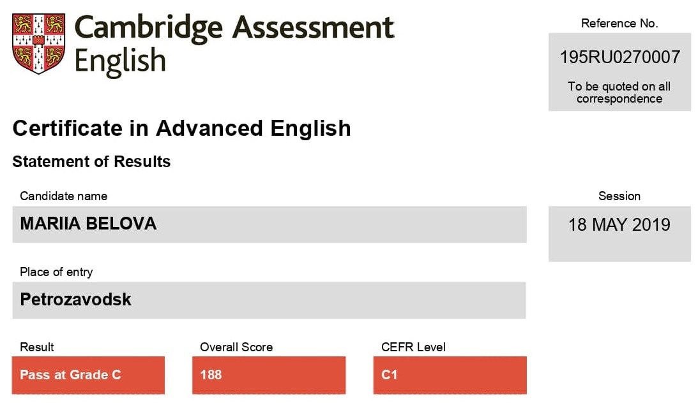

# Maria Belova

## Contacts

**Phone:** +7 (953) 545-41-44\
**E-mail:** masha.belova.01@mail.ru\
**GitHub:** [lunarEclipse423](https://github.com/lunarEclipse423)\
**Telegram:** [Maria Belova](https://t.me/Graf_V)

## About Me

Ever since high school, I've been interested in IT and programming. That is the main reason why I was
thrilled to go to Peter the Great St. Petersburg Polytechnic University to study Fundamental Computer
Science and Information Technology.

Studying at the university taught me a whole host of valuable skills, such as being collaborative,
independent (which is more about time management and study-life-balance), active and persistent.
In addition to the previously listed skills, I would like to highlight self-learning since this ability cannot be dispensed with both at the university and in real life.

At present, I'm 20 years old and I'm a 3rd year student, learning web programming at the RS-School in
parallel. In my opinion, Frontend Development is not only one of the most promising industries of the
future, but it also provides sizeable opportunities for showing your creativity in elaborating effective
solutions, as well as simplifying people's lives by creating user-friendly websites and apps. I am certain that
Web Development is the field in which I see myself and want to actively develop in the upcoming years.

## Skills

- JavaScript Basics
- HTML5
- CSS3
- C++
- Java
- Python Basics
- Dart
- Selenium
- Git, Github, Gitlab
- Apache Maven
- VS Code, IntelliJ IDEA, Microsoft Visual Studio, PyCharm, Android Studio
- Windows OS, Linux (Ubuntu)

## Code Example

### Count the number of Duplicates (from [Codewars](https://www.codewars.com))

Write a function that will return the count of **distinct case-insensitive** alphabetic characters and numeric digits that occur more than once in the input string. The input string can be assumed to contain only alphabets (both uppercase and lowercase) and numeric digits.

### Example

"abcde" -> 0 `# no characters repeats more than once`\
"aabbcde" -> 2 `# 'a' and 'b'`\
"aabBcde" -> 2 `# 'a' occurs twice and 'b' twice (`b` and `B`)`\
"indivisibility" -> 1 `# 'i' occurs six times`\
"Indivisibilities" -> 2 `# 'i' occurs seven times and 's' occurs twice`\
"aA11" -> 2 `# 'a' and '1'`\
"ABBA" -> 2 `# 'A' and 'B' each occur twice`

### Solution

```javascript
function duplicateCount(text){
  var obj = {};
  for (var i = 0; i < text.length; ++i) {
    obj[text[i].toLowerCase()] ? obj[text[i].toLowerCase()]++ : obj[text[i].toLowerCase()] = 1;
  }

  var duplicates = 0;
  for (prop in obj) {
    if (obj[prop] > 1) {
      duplicates++;
    }
  }

  return duplicates;
}
```
## Education

* **Peter the Great St. Petersburg Polytechnic University, Bachelor's degree**
    * Fundamental Computer Science and Information Technology
* **Courses**
    * [Jenny's lectures CS/IT NET&JRF](https://www.youtube.com/c/JennyslecturesCSITNETJRF)
    * [freeCodeCamp.org lectures](https://www.youtube.com/c/Freecodecamp)
    * Technopolis (Mail.ru Group)
        * Introduction to Java
        * Test automation
    * Udemy
        * Java Programming Masterclass covering Java 11 & Java 17
    * Stepik
        * JavaScript for beginners
        * Hexlet: An Introduction to Programming (JavaScript ES6)
    * Code Basics
        * HTML
        * CSS
    * RS Schools 
        * JavaScript/Front-end. Stage 1 (in progress)
    * [JavaScript Manual](https://learn.javascript.ru/) (in progress)
* **Trainings**
    * One month training in T-Systems (Data Science and Neural Networks)
* **Projects**
    * University project "Doggo" - mobile android app for safe dog walking (private project)

## Languages

* **Russian** - Native Speaker
* **English** - C1

